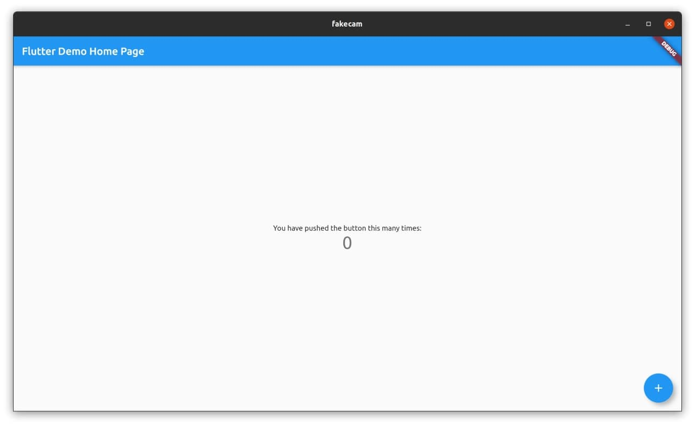
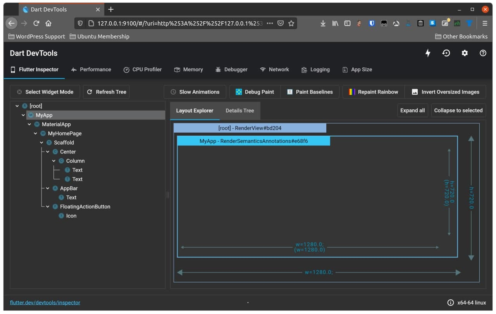

Recently there was an announcement from Ubuntu that the desktop team are working on a [replacement for the Ubiquity installer](https://discourse.ubuntu.com/t/refreshing-the-ubuntu-desktop-installer/20659). The really interesting part of the post by Martin Wimpress, head of the Ubuntu Desktop team at Canonical, is that the new installer will be built using Flutter.

[Flutter](https://flutter.dev) is a cross-platform User Interface framework that can target Linux, macOS, Windows, Android, and iOS all from the same source code. I have been aware of Flutter for some time now but have been trepidatious in jumping in to sample the water, because I am completely unfamilier with the Dart programming language and was worried about making the time investment.

With the news from Ubuntu I decided that now is a good time to get my feet wet and find out what this new shiny is all about. To that end, I have been installed Flutter and managed to get the sample application running on Ubuntu! There were a few gotchas, however, so below I've summarised the important steps to get a fully functional toolchain set up:

## Installing Flutter

First up, we install the Flutter Snap Package. Run:

```bash
sudo snap install flutter --classic
```

By default this will install the commands:

* flutter
* flutter.dart
* flutter.openurl

We can reduce the typing required to call `dart`, along with reducing the cognitive load when translating any instructions that do not expect the `flutter.` prefix. Run the following to map `flutter.dart` to the name `dart` so you can call it without the prefix:

```bash
sudo snap alias flutter.dart dart
```

Next, we need the Android Studio. The instructions supplied by Google require you to download and extract a `.tar.gz` file to a place of your choosing. That's too much work. Instead, install the community-maintained Snap Package with:

```bash
sudo snap install android-studio --classic
```

Find the Android Studio icon in your desktop applications menu, such as the dash in Gnome or the K menu in KDE, or execute in the terminal:

```bash
android-studio
```

Run through the first-install wizard accepting all the defaults. We won't be using Android Studio for anything other than its ability to maintain the Android SDK and emulators.

Now, flutter needs to know the location of our Android Studio snap, or you will be unable to build an app even if you're not targetting Android, so run:

```bash
flutter config --android-studio-dir /snap/android-studio/current/android-studio
```

We need to accept the Android licenses to use Flutter, so run:

```bash
flutter doctor --android-licenses
```

Read through each license it presents (you're gonna read them, right?) and accept them with a `Y` keypress followed by enter when prompted.

If you are likely to be developing for Linux, macOS, or Windows in your Flutter projects, you need to update to the **dev** branch of Flutter and enable each toolchain. Run:

```bash
# switch to dev branch
flutter channel dev
# update Flutter to the latest dev branch revision
flutter upgrade
# enable Linux toolchain
flutter config --enable-linux-desktop
# enable macOS toolchain
flutter config --enable-macos-desktop
# enable Windows toolchain
flutter config --enable-windows-desktop
```

> Note: while you can set-up your project for macOS and Windows support you must use those operating systems to actually build an app targeting each.

Finally, we check that everything is correctly set-up. Run:

```bash
flutter doctor
```

If everything is good, it'll output similar to below:

```plain
Doctor summary (to see all details, run flutter doctor -v):
[✓] Flutter (Channel dev, 1.26.0-17.1.pre, on Linux, locale en_GB.UTF-8)
[✓] Android toolchain - develop for Android devices (Android SDK version 30.0.3)
[✓] Chrome - develop for the web
[✓] Linux toolchain - develop for Linux desktop
[✓] Android Studio
[✓] Connected device (2 available)

• No issues found!
```

## Testing Flutter by building a sample

Create a new directory to hold our sample app. Run:

```bash
mkdir flutter-example
cd flutter-example
```

Now we must create the app structure. Run:

```bash
flutter create .
```

This will scaffold out a new Flutter app with support for each of the platforms that are enabled. By default the enabled platforms are Android, iOS, and Web. If you enabled the desktop platforms above then it will also scaffold out those.

The main application code is stored inside the `lib/` folder, while each platform will have a respective folder to hold the native C and Java code. Normally you'd use Flutter plugins to enable native features and rely on coding your app in Dart. Flutter plugins can be discovered at [pub.dev](https://pub.dev/).

Test the app with:

```bash
flutter run -d linux
```

This will build and run the sample app.



It will also start a debugger server that you can connect to in your web browser; the URL will be in the output text when you run the app:

```plain
flutter run -d linux
Running "flutter pub get" in flutter-sample...                            392ms
Launching lib/main.dart on Linux in debug mode...
Building Linux application...                                           
Activating Dart DevTools...                                         4.5s
Syncing files to device Linux...                                    89ms

Flutter run key commands.
r Hot reload. 🔥🔥🔥
R Hot restart.
h Repeat this help message.
d Detach (terminate "flutter run" but leave application running).
c Clear the screen
q Quit (terminate the application on the device).
An Observatory debugger and profiler on Linux is available at:
http://127.0.0.1:38399/PRAhGqkGwN0=/

Flutter DevTools, a Flutter debugger and profiler, on Linux is available at:
http://127.0.0.1:9100?uri=http%3A%2F%2F127.0.0.1%3A38399%2FPRAhGqkGwN0%3D%2F
```

The debugging web page looks like this:



## Wrap up

In this post, I showed how to install and configure Flutter and the Android toolchain, without hitting the issues that I encountered myself. I also showed creating and debugging a sample Flutter app, and enabling the toolchain for Linux, macOS, and Windows desktop apps.
