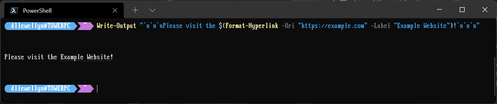

Having found that the Windows Terminal has gained support for the ANSI Escape sequence documented in [the Hyperlinks in Terminal Emulators GIST](https://gist.github.com/egmontkob/eb114294efbcd5adb1944c9f3cb5feda) I wrote a nice and simple PowerShell function to output these hyperlinks without having to remember the escape sequences yourself.

```powershell
function Format-Hyperlink {
  param(
    [Parameter(ValueFromPipeline = $true, Position = 0)]
    [ValidateNotNullOrEmpty()]
    [Uri] $Uri,

    [Parameter(Mandatory=$false, Position = 1)]
    [string] $Label
  )

  if ($Label) {
    return "`e]8;;$Uri`e\$Label`e]8;;`e\"
  }

  return "$Uri"
}
```

You can use this like so:

```powershell
"https://example.com" | Format-Hyperlink -Label "Example Website"

# or

Format-Hyperlink -Uri "https://example.com" -Label "Example Website"
```

If you forget to add a `Label` then the function will simply print the URL directly, without the formatting sequences.

You can also use this as part of a Write-Output line:

```powershell
Write-Output "`n`n`nPlease visit the $(Format-Hyperlink -Uri "https://example.com" -Label "Example Website")!`n`n`n"
```



This should also work in PowerShell on macOS and Linux, too. (Note that it requires PowerShell 7+ for the escape sequences to be sent correctly)