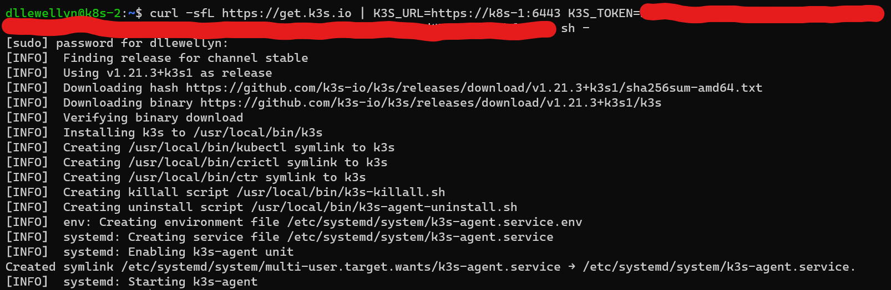

To get going with Kubernetes (K8s) we need to install a distribution of K8s. For this tutorial I will use [K3s by Rancher Labs](https://k3s.io).<!-- See the [Microk8s page](../mikrok8s) if you want to use the distribution of [K8s by Canonical distributed in the Snap Store](https://snapstats.org/snaps/microk8s). -->

You should replace my username and node names in the instructions below. For reference, my username is `dllewellyn`, and my nodes are named as follows:

- k8s-1
- k8s-2
- k8s-3

## Start the first node

1. Login to the first node:
   ```bash
   ssh dllewellyn@k8s-1
   ```
1. On the first node run the K3s installation script that automates everything - enter your sudo password if you are prompted:
   ```bash
   curl -sfL https://get.k3s.io | sh -
   ```
1. Get the token for joining more nodes to the cluster - save this somewhere you can easily copy and paste:
   ```bash
   sudo cat /var/lib/rancher/k3s/server/node-token
   ```


## Start the second node
1. Login to the second node in a new terminal session:
   ```bash
   ssh dllewellyn@k8s-2
   ```
1. Install and join the node to the primary node we installed above - if your second node cannot resolve the primary node's name to its IP address then use the IP address directly - Replace `mynodetoken` with the node-token you saved above:
   ```bash
   curl -sfL https://get.k3s.io | K3S_URL=https://k8s-1:6443 K3S_TOKEN=mynodetoken sh -
   ```

   - `K3S_URL` is the URL of your primary server in the cluster.
   - `K3S_TOKEN` will be used to authenticate the new node when joining the cluster. It must match with the token in the file `/var/lib/rancher/k3s/server/node-token` on the primary server.



## Start the third node

This is done exactly the same way as the second node, so the steps are omitted. Repeat the same steps you used for the second node, ensuring that you are in a session on the third node:

```bash
ssh dllewellyn@k8s-3
```


## Other Chapters

